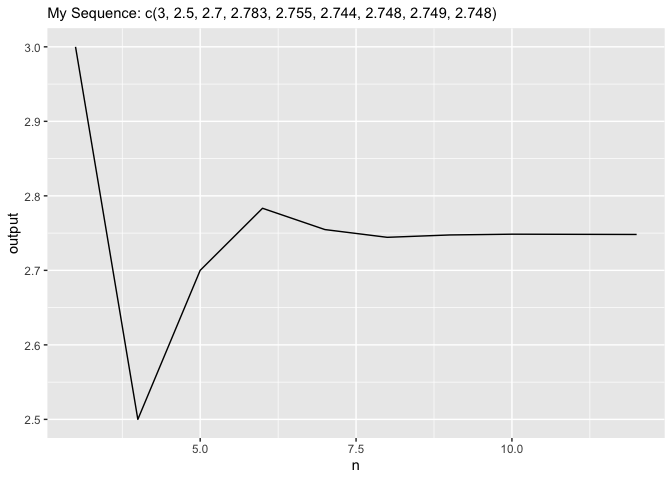

<!-- README.md is generated from README.Rmd. Please edit that file -->

# hw04adim7calcnpltr

<!-- badges: start -->
<!-- badges: end -->

The goal of hw04adim7calcnpltr is to …

## Installation

This package is only available by permission of the author at:

``` r
install.packages("hw04adim7calcnpltr")
```

## Example

This is a basic example which shows you how to solve a common problem:

``` r
# library(hw04adim7calcnpltr)
```

What is special about using `README.Rmd` instead of just `README.md`?
You can include R chunks like so:

``` r
my_data <- tibble::tribble(
  ~x, ~y, ~z, ~n,
  2,4,3,3,
  2,4,3,4,
  2,4,3,5,
  2,4,3,6,
  2,4,3,7,
  2,4,3,8,
  2,4,3,9,
  2,4,3,10,
  2,4,3,12)
```

You’ll still need to render `README.Rmd` regularly, to keep `README.md`
up-to-date. `devtools::build_readme()` is handy for this. You could also
use GitHub Actions to re-render `README.Rmd` every time you push. An
example workflow can be found here:
<https://github.com/r-lib/actions/tree/master/examples>.

You can also embed plots, for example:



In that case, don’t forget to commit and push the resulting figure
files, so they display on GitHub and CRAN.
